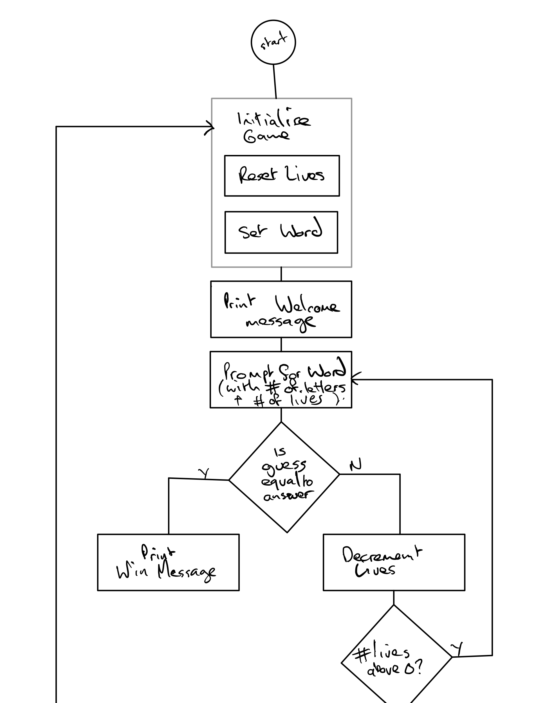
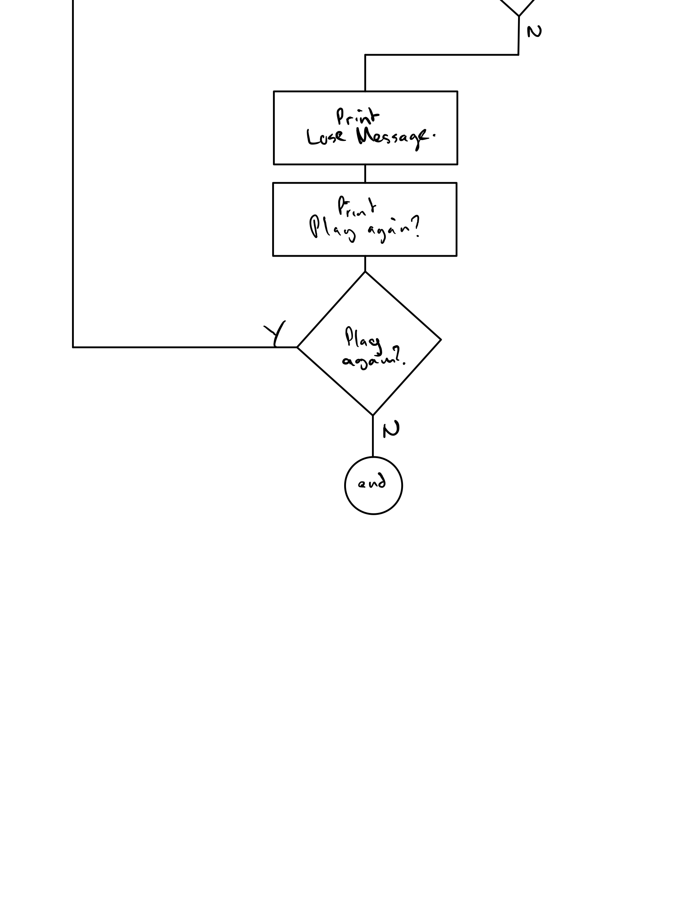

# 03_BullCowGame

## Introduction

Bull Cow Game is an [isogram](https://en.wikipedia.org/wiki/Isogram) guessing
game

## Game Design

When a guess is made, it will either be:

* correct: The game is won
* incorrect: the following may be true
  * The word length is incorrect: allow the user to try again 
  * The word isn't an isogram: allow the user to try again
  * The word isn't correct: remove a life and return the following
    * number of cows: letters that are correct *but* in the incorrect place
    * number of bulls: letters that are correct *and* in the correct place

### Game Loop

